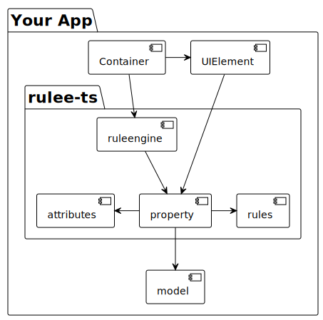

# rulee-ts
[](https://www.npmjs.com/package/rulee-ts)
[](https://github.com/mann-software/rulee-ts/actions?query=workflow%3ACI)

> UI-centered rule engine to manage your business rules.

**Note:** rulee-ts is still *experimental* as long as the version is < 1.0.0. With the beginning of version 1.0.0 the author will use rulee-ts for his own projects in production and semantic versioning will be applied from then on.

Feature-rich to make things easy:
- fully typed rule definitions
- supports synchronous and asynchronous processing of rules
- abstract properties can be fields, groups, list ... and are composable
- define rules via builders
- dependency graph for efficient processing and visualization
- complex ui behavior, e.g. backpressure handling included
- and more ...

## Install

```
$ npm install rulee-ts
```

## Architecture Overview

rulee-ts is based on properties. A property can be a value, group or list - with real state or derived state.
Each property has various attributes: visibility, readonly, errors/warnings, processing, etc. - adding custom attributes is possible.

You can define composable (sync or async) rules and connect them to one or many properties. 
The rules can be used to define the derived state or to define the attributes of a property. 

In the end you can connect a property to an UI field. 
The UI field can get all the information it needs from the property and puts the new value into the property on change. 
Thanks to an internal dependency graph, all other dependent properties get updated as well.

The rule engine contains all the properties and offers operations like validation, or the import/export of data.
The rule engine lives in some sort of container of your app, depending on your chosen technology.
rulee-ts is technology-agnostic with no further dependencies and can be used with react, vue, angular, solid, svelte, and so on.




## Getting started

Documentation still to be done. For now, see tests in folder: `src/__tests__`

## Contribute

Contributions to rulee-ts are very welcome! Please contact [andre@mann-software.de](mailto:andre@mann-software.de).

## License

Copyright (c) 2022 Andre Mann and Contributors licensed under BSD 3-Clause License.
